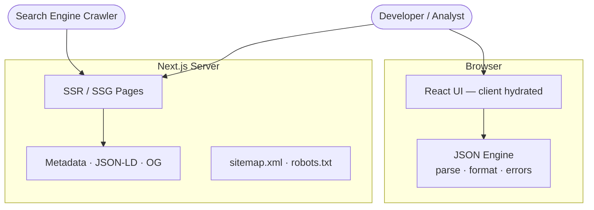
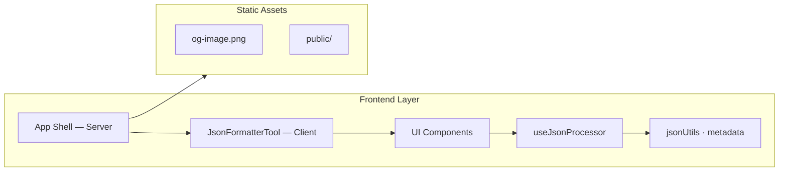
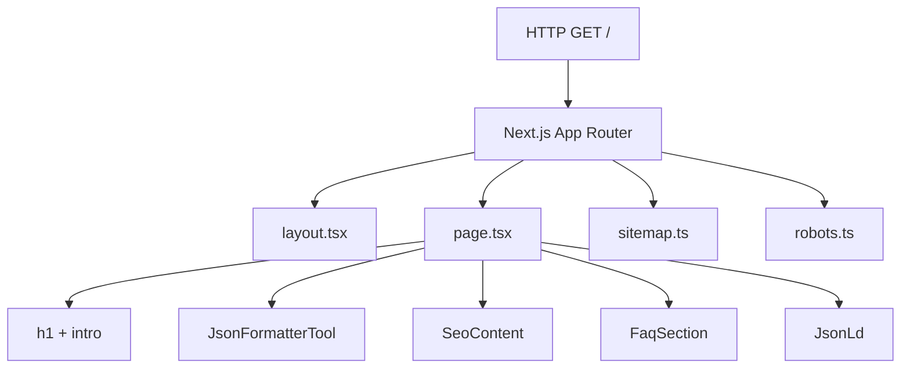
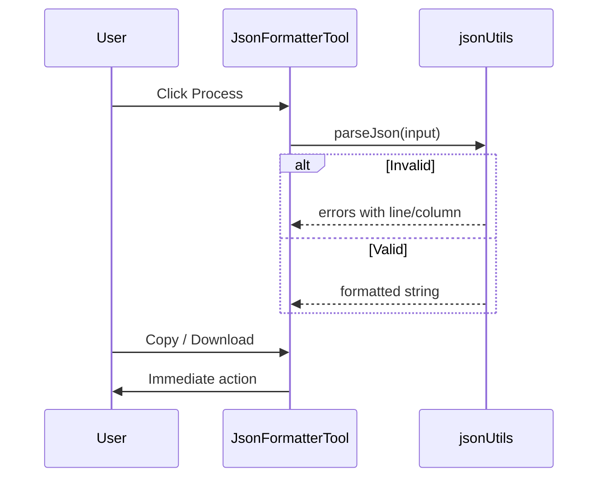
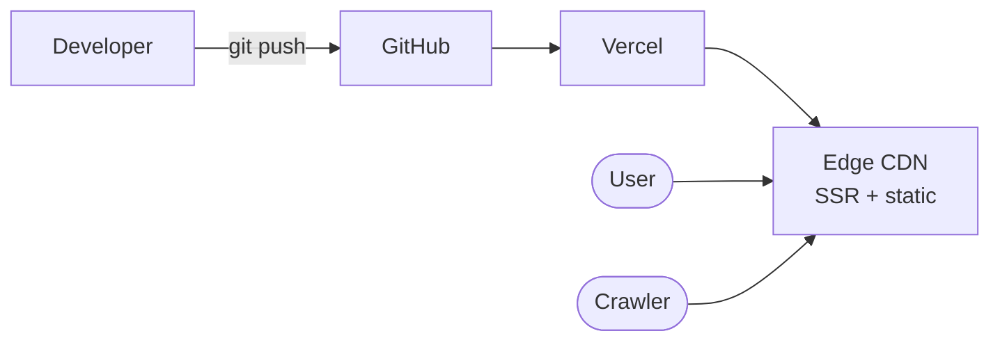

# JSON Formatter & Validator — Architecture Document

**Project:** json-validator  
**Version:** 2.0  
**Last updated:** 2026-06-23  
**Reference:** [JSON Formatter & Validator (Curious Concept)](https://jsonformatter.curiousconcept.com/#)

---

## 1. Overview

This document describes the technical architecture for a single-page JSON formatter and validator. The design follows [jsonformatter.curiousconcept.com](https://jsonformatter.curiousconcept.com/#) — client-side JSON processing with instant validate/format feedback — with **no backend** in v1.

The application is architected for **SEO from the start**: public pages are server-rendered with crawlable HTML, structured metadata, and performance characteristics that satisfy search engine indexing requirements.

**Monetization infrastructure (email capture, payments, ads) is deferred.** The architecture stays frontend-only to minimize cost and complexity while building organic traffic.

### 1.1 Design Principles

1. **Client-first processing** — JSON never leaves the browser during validate/format.
2. **No backend (v1)** — Static/SSR site only; no database, no API routes, no user data storage.
3. **Instant export** — Copy and download work immediately with no gates.
4. **Simple deployment** — Single Next.js app deployable to Vercel with zero external services.
5. **SEO-first rendering** — Marketing content and metadata are server-rendered; the interactive tool hydrates on the client.

---

## 2. System Context



**Rendering split:** Crawlers and first paint receive fully rendered HTML (title, headings, SEO copy). The JSON tool is a Client Component that hydrates after load.

### 2.1 Comparison with Reference Architecture

| Aspect | [Curious Concept tool](https://jsonformatter.curiousconcept.com/#) | This application |
|--------|---------------------------------------------------------------------|------------------|
| JSON processing | Client-side (browser) | Client-side (browser) |
| Server role | Optional URL/process API | SSR/SSG for SEO only |
| Export | Immediate copy/download | Immediate copy/download |
| Validation specs | Multiple RFC/ECMA options | RFC 8259 via `JSON.parse` (MVP) |
| User data sent to server | Optional (URL params) | None — JSON stays in browser |
| SEO / URL structure | Hash-based URL (`/#`) | Clean URLs (`/`, `/privacy`) |
| Backend | None required for core tool | None (v1) |

---

## 3. High-Level Architecture



No API layer or data layer in v1.

---

## 4. Technology Stack

### 4.1 Stack (MVP)

| Layer | Technology | Rationale |
|-------|------------|-----------|
| Framework | **Next.js 15** (App Router) | SSR/SSG for SEO; Metadata API |
| Language | **TypeScript** | Type safety for JSON utilities |
| Styling | **Tailwind CSS** | Rapid UI; clean developer-tool aesthetic |
| JSON engine | **Native `JSON.parse` / `JSON.stringify`** | Zero deps; RFC 8259 compatible |
| SEO | **Next.js Metadata API + JSON-LD** | OG, canonical, sitemap built-in |
| Hosting | **Vercel** | Edge SSR, HTTPS, Core Web Vitals |
| Analytics | **Google Search Console** + optional Plausible | Organic tracking; privacy-friendly |

No database, ORM, or email service in v1.

---

## 5. Frontend Architecture

### 5.1 Directory Structure

```
json-validator/
├── docs/
│   ├── REQUIREMENTS.md
│   └── ARCHITECTURE.md
├── public/
│   └── og-image.svg
├── src/
│   ├── app/
│   │   ├── layout.tsx
│   │   ├── page.tsx
│   │   ├── globals.css
│   │   ├── privacy/page.tsx
│   │   ├── sitemap.ts
│   │   └── robots.ts
│   ├── components/
│   │   ├── JsonFormatterTool.tsx   # Client — interactive tool
│   │   ├── SeoContent.tsx            # Server — crawlable copy
│   │   ├── FaqSection.tsx            # Server — FAQ + JSON-LD
│   │   ├── JsonLd.tsx                # Server — WebApplication schema
│   │   └── SiteFooter.tsx
│   ├── hooks/
│   │   └── useJsonProcessor.ts
│   ├── lib/
│   │   ├── jsonUtils.ts
│   │   ├── metadata.ts
│   │   └── constants.ts
│   └── types/
│       └── index.ts
├── package.json
└── .env.local                      # NEXT_PUBLIC_SITE_URL only
```

### 5.2 Server vs Client Component Split

| Component | Render mode | Rationale |
|-----------|-------------|-----------|
| `layout.tsx` | Server | Global metadata, `<html lang="en">`, fonts |
| `page.tsx` | Server shell | Composes SEO content + client tool |
| `JsonFormatterTool` | **Client** | State, clipboard, file download |
| `SeoContent` | **Server** | Crawlable how-to copy |
| `FaqSection` | **Server** | FAQ + FAQPage JSON-LD |
| `JsonLd` | **Server** | WebApplication structured data |
| `SiteFooter` | **Server** | Internal links |
| `privacy/page.tsx` | **SSG** | Static privacy page |

**Rule:** Keep `"use client"` boundary as low as possible — only the tool island is a client component.

### 5.3 SEO Architecture



#### Metadata

| Tag | Home page value |
|-----|-----------------|
| `<title>` | JSON Formatter & Validator — Format and Validate JSON Online |
| `description` | Free online tool to format, beautify, and validate JSON. Paste your JSON, click Process, get instant feedback. |
| `canonical` | `{SITE_URL}/` |
| `robots` | `index, follow` |

#### JSON-LD — WebApplication

Embedded server-side via `JsonLd.tsx` with `applicationCategory: DeveloperApplication`, `price: 0`.

#### Sitemap & Robots

- `sitemap.ts` — `/`, `/privacy`
- `robots.ts` — allow `/`, disallow nothing (no `/api/` in v1)

#### Core Web Vitals

| Technique | Implementation |
|-----------|----------------|
| Font loading | `next/font` with `display: swap` |
| JS bundle | Client boundary only on tool |
| LCP | Server-rendered h1 + intro |
| CLS | Min-heights on textarea panels |

### 5.4 JSON Processing Module

```typescript
// lib/jsonUtils.ts

type IndentTemplate = "twospace" | "fourspace" | "onetab" | "compact";

interface ParseSuccess { ok: true; value: unknown; }
interface ParseFailure {
  ok: false;
  errors: Array<{ message: string; line?: number; column?: number; offset?: number }>;
}
type ParseResult = ParseSuccess | ParseFailure;

function parseJson(input: string): ParseResult;
function formatJson(value: unknown, template: IndentTemplate): string;
function offsetToLineColumn(input: string, offset: number): { line: number; column: number };
```

**Processing flow:**



**Templates:**

| Key | `JSON.stringify` space arg |
|-----|---------------------------|
| `twospace` | `2` |
| `fourspace` | `4` |
| `onetab` | `"\t"` |
| `compact` | `undefined` |

---

## 6. Security

| Threat | Mitigation |
|--------|------------|
| XSS via JSON input | Render as plain text only; never `dangerouslySetInnerHTML` |
| Data exfiltration | No server — JSON never transmitted |
| Man-in-the-middle | HTTPS via Vercel |

No PII collected in v1 — privacy policy documents client-side-only processing.

---

## 7. Deployment



| Environment | Command | SEO |
|-------------|---------|-----|
| Local | `npm run dev` | `localhost` |
| Production | Vercel auto-deploy | Submit sitemap to Search Console |

### Environment Variables

| Variable | Required | Description |
|----------|----------|-------------|
| `NEXT_PUBLIC_SITE_URL` | Production | Canonical base URL |

### SEO Launch Checklist

1. Set `NEXT_PUBLIC_SITE_URL` to production domain
2. Verify `/sitemap.xml` and `/robots.txt`
3. Lighthouse SEO audit ≥ 90
4. Google Rich Results Test — valid WebApplication JSON-LD
5. Submit sitemap to Google Search Console and Bing Webmaster Tools
6. Confirm view-source shows title, h1, SEO content without JS

---

## 8. Observability

| Signal | Tool |
|--------|------|
| SEO | Google Search Console |
| Core Web Vitals | Vercel Speed Insights |
| Errors | Sentry (optional) |

---

## 9. Future Architecture Extensions

| Feature | Impact |
|---------|--------|
| File upload | Client-only — `FileReader` API |
| Auto-fix JSON | Client pre-parse transformer |
| URL JSON fetch | New API route with SSRF protection — first backend addition |
| Monetization — ads | Static ad slots in Server Components; no architecture change |
| Monetization — premium | Feature flags + optional Stripe; may add auth |
| Monetization — email gate | `POST /api/leads` + Postgres — deferred ADR |
| Help pages | New SSG routes; expand sitemap |
| Blog | MDX content layer |

---

## 10. Architecture Decision Records

### ADR-001: Client-side JSON processing

**Decision:** All validate/format logic runs in the browser.  
**Rationale:** Matches reference tool; zero server compute; user JSON stays local.

### ADR-002: No backend in v1

**Decision:** No API routes, database, or email capture for MVP.  
**Rationale:** Ship fast; build SEO traffic; add monetization when justified.  
**Trade-off:** No lead data until a later phase.

### ADR-003: Next.js for SEO + tool in one repo

**Decision:** Next.js App Router with hybrid SSR + client island.  
**Rationale:** Native metadata, sitemap, SSR; single deploy target.

### ADR-004: Hybrid SSR + client island

**Decision:** Server-render SEO content; Client Component for interactive tool only.  
**Rationale:** Crawlers get full HTML; tool stays responsive.

### ADR-005: Clean URLs over hash routing

**Decision:** `/` and `/privacy` instead of `/#`.  
**Rationale:** Better indexing than [reference hash URLs](https://jsonformatter.curiousconcept.com/#).

### ADR-006: Instant export (no gates)

**Decision:** Copy and download require no signup or email.  
**Rationale:** Matches user expectation for free developer tools; maximizes retention and SEO engagement signals.

---

## 11. References

- [JSON Formatter & Validator — Curious Concept](https://jsonformatter.curiousconcept.com/#)
- [RFC 8259 — JSON Data Interchange Format](https://www.rfc-editor.org/rfc/rfc8259)
- [Next.js App Router](https://nextjs.org/docs/app)
- [Next.js — Metadata](https://nextjs.org/docs/app/building-your-application/optimizing/metadata)
- [Google Search Central — SEO Starter Guide](https://developers.google.com/search/docs/fundamentals/seo-starter-guide)
- [Schema.org — WebApplication](https://schema.org/WebApplication)
